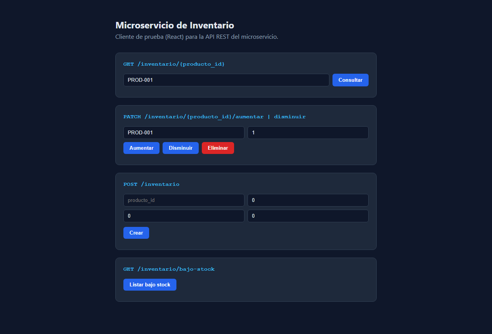
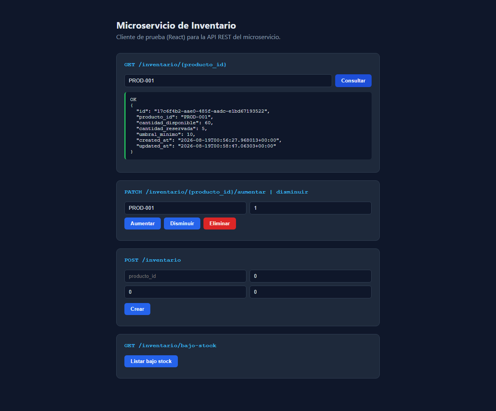
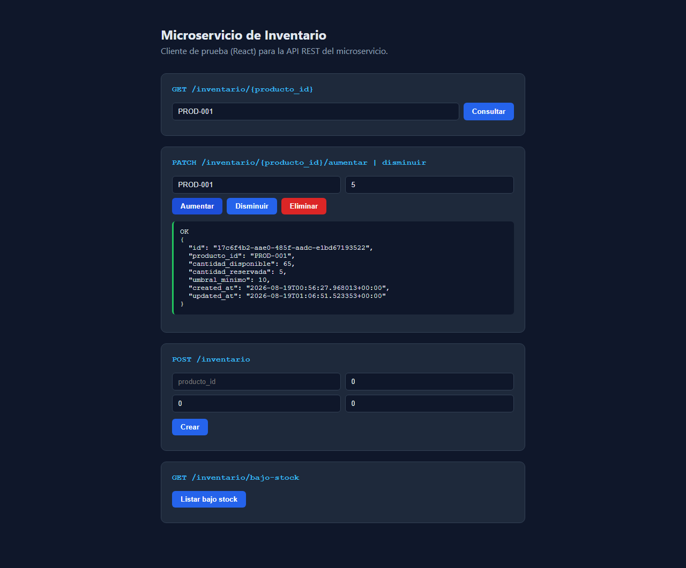
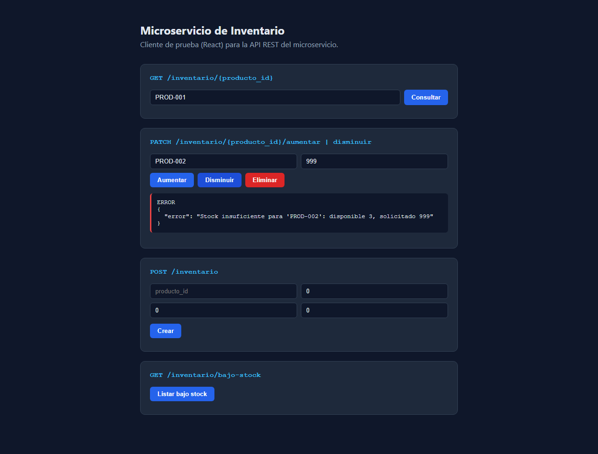
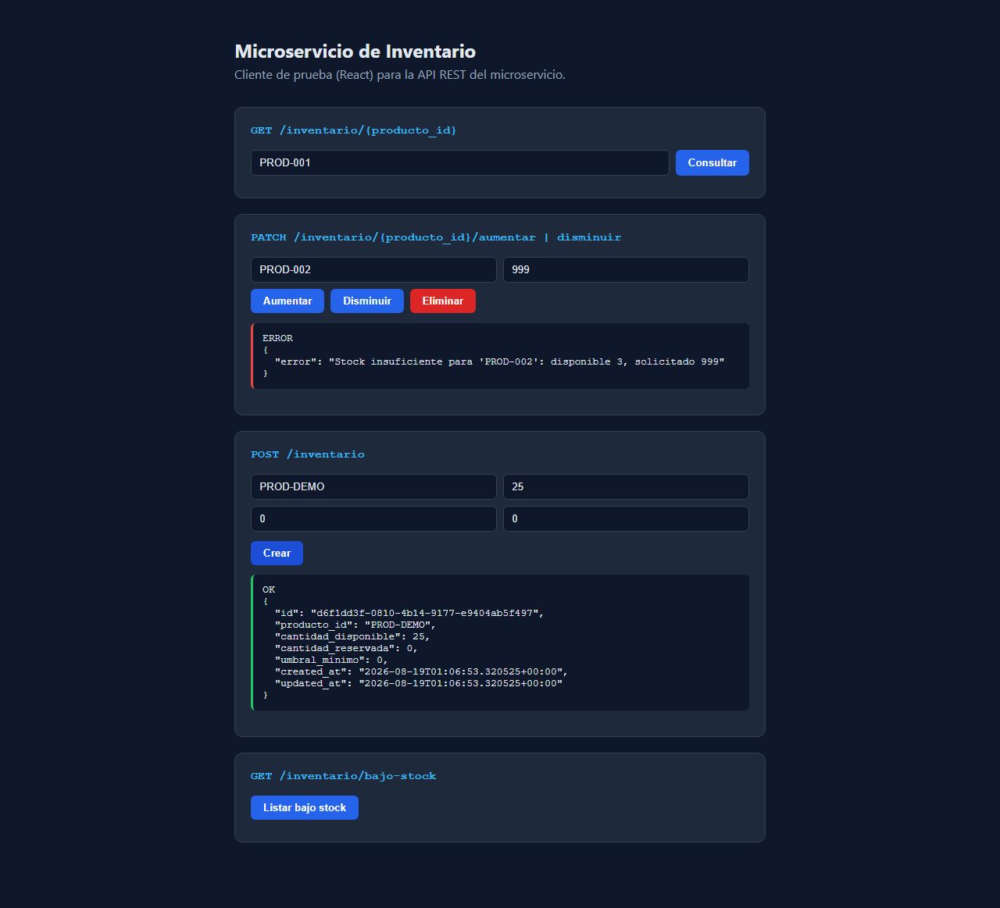
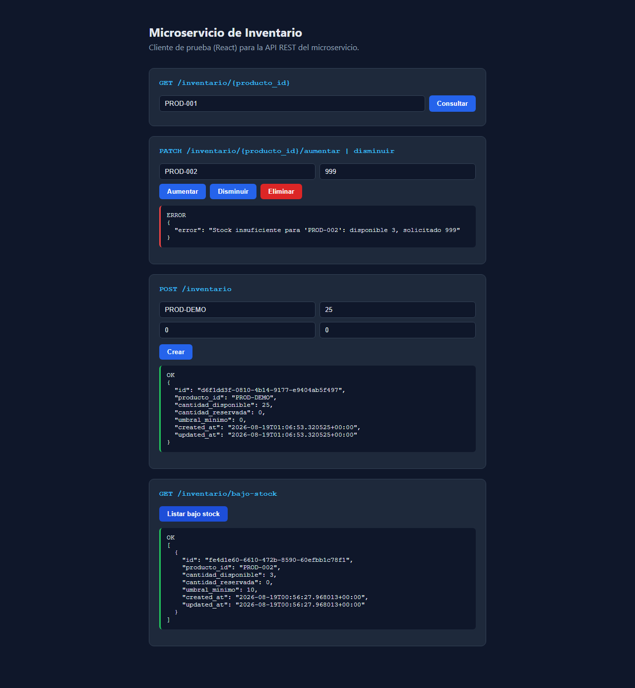

# Microservicio de Inventario

Microservicio independiente responsable de controlar las **existencias físicas** de cada producto (cantidad disponible, cantidad reservada y umbral mínimo de stock), separado del catálogo de productos. Expone una API REST propia y persiste sus datos en su propia base de datos PostgreSQL (Supabase).

## Descripción del servicio

- **Responsabilidad única**: gestiona únicamente el inventario/stock de productos, no el catálogo (nombre, precio, categoría) ni los pedidos.
- **Independencia de despliegue**: es una aplicación backend (Node.js/Express) ejecutable por sí sola, sin depender de que otros microservicios estén activos.
- **Persistencia propia**: base de datos PostgreSQL propia, gestionada en Supabase, con una única tabla `inventario`.
- **Comunicación desacoplada**: expone su funcionalidad exclusivamente mediante una API REST (HTTP/JSON); otros servicios (por ejemplo, Pedidos) la consumen por HTTP, nunca accediendo directamente a su base de datos.

## Diagrama de arquitectura


El diagrama muestra las tres capas internas del servicio (API/controladores → lógica de negocio → acceso a datos), la base de datos propia (PostgreSQL/Supabase), los endpoints expuestos, y su punto de integración con otros servicios del sistema: un cliente React de prueba y el (futuro) microservicio de Pedidos consumen esta API, mientras que este servicio podría consultar en el futuro al microservicio de Catálogo para validar productos.

## Tecnologías utilizadas

| Componente | Tecnología |
|---|---|
| Backend / API REST | Node.js + Express |
| Base de datos | PostgreSQL (Supabase) |
| Acceso a datos | `@supabase/supabase-js` |
| Frontend de prueba | React + Vite |
| Pruebas | `node:test` (unitarias de validación) |

## Estructura del repositorio

```
microservicio-inventario/
├── backend/
│   ├── src/
│   │   ├── config/         # Cliente de Supabase
│   │   ├── controllers/    # Controladores HTTP
│   │   ├── routes/         # Definición de rutas REST
│   │   ├── services/       # Lógica de negocio y reglas de validación
│   │   ├── repositories/   # Capa de acceso a datos (Supabase)
│   │   ├── middlewares/    # Validación de entrada y manejo de errores
│   │   ├── utils/          # Utilidades (ApiError)
│   │   ├── app.js
│   │   └── server.js
│   ├── tests/               # Pruebas unitarias
│   ├── .env.example
│   └── package.json
├── frontend/                # Cliente React para probar la API
│   └── src/
├── database/
│   └── schema.sql           # Esquema de la tabla inventario + función bajo-stock
├── docs/
│   └── arquitectura.svg     # Diagrama de arquitectura
└── README.md
```

## Modelo de datos

Tabla `inventario`:

| Campo | Tipo | Regla |
|---|---|---|
| `id` | uuid (PK) | autogenerado |
| `producto_id` | text (único) | obligatorio |
| `cantidad_disponible` | integer | `>= 0` |
| `cantidad_reservada` | integer | `>= 0` |
| `umbral_minimo` | integer | `>= 0` |
| `created_at` / `updated_at` | timestamptz | automáticos |

## Endpoints

Base URL local: `http://localhost:4001`

### GET /inventario/{producto_id}

Obtiene el inventario de un producto.

```bash
curl http://localhost:4001/inventario/PROD-001
```

Respuesta `200 OK`:
```json
{
  "id": "a1b2c3d4-...",
  "producto_id": "PROD-001",
  "cantidad_disponible": 50,
  "cantidad_reservada": 5,
  "umbral_minimo": 10,
  "created_at": "2026-08-18T10:00:00.000Z",
  "updated_at": "2026-08-18T10:00:00.000Z"
}
```

Respuesta `404 Not Found` (producto sin inventario registrado):
```json
{ "error": "No existe inventario para el producto 'PROD-999'" }
```

### PATCH /inventario/{producto_id}/aumentar

Incrementa la cantidad disponible.

```bash
curl -X PATCH http://localhost:4001/inventario/PROD-001/aumentar \
  -H "Content-Type: application/json" \
  -d '{"cantidad": 10}'
```

Respuesta `200 OK`: objeto de inventario actualizado.
Respuesta `400 Bad Request` si `cantidad` falta, no es entero o es `<= 0`.
Respuesta `404 Not Found` si el producto no existe.

### PATCH /inventario/{producto_id}/disminuir

Reduce la cantidad disponible. Valida que exista stock suficiente.

```bash
curl -X PATCH http://localhost:4001/inventario/PROD-001/disminuir \
  -H "Content-Type: application/json" \
  -d '{"cantidad": 5}'
```

Respuesta `200 OK`: objeto de inventario actualizado.
Respuesta `409 Conflict` si la cantidad solicitada supera la disponible:
```json
{ "error": "Stock insuficiente para 'PROD-001': disponible 3, solicitado 5" }
```

### GET /inventario/bajo-stock

Lista los productos cuya `cantidad_disponible` está en o por debajo de su `umbral_minimo`.

```bash
curl http://localhost:4001/inventario/bajo-stock
```

Respuesta `200 OK`:
```json
[
  { "producto_id": "PROD-002", "cantidad_disponible": 3, "umbral_minimo": 10, "...": "..." }
]
```

### POST /inventario

Crea un nuevo registro de inventario para un producto (endpoint adicional, necesario para dar de alta productos nuevos).

```bash
curl -X POST http://localhost:4001/inventario \
  -H "Content-Type: application/json" \
  -d '{"producto_id": "PROD-010", "cantidad_disponible": 20, "umbral_minimo": 5}'
```

Respuesta `201 Created`. Respuesta `409 Conflict` si el `producto_id` ya existe.

### DELETE /inventario/{producto_id}

Elimina el registro de inventario de un producto.

```bash
curl -X DELETE http://localhost:4001/inventario/PROD-010
```

Respuesta `204 No Content`. Respuesta `404 Not Found` si no existe.

### Códigos de estado usados

| Código | Cuándo |
|---|---|
| 200 | Consulta o actualización exitosa |
| 201 | Registro creado |
| 204 | Eliminación exitosa (sin contenido) |
| 400 | Validación de entrada fallida (tipo de dato, campo obligatorio) |
| 404 | Producto/ruta no encontrada |
| 409 | Conflicto de reglas de negocio (duplicado, stock insuficiente) |
| 500 | Error interno no controlado |

## Instalación y ejecución local

### 1. Requisitos

- Node.js 18+
- Una cuenta y proyecto en [Supabase](https://supabase.com) (gratuito)

### 2. Crear la base de datos

En el panel de Supabase, abre **SQL Editor** y ejecuta el contenido de [`database/schema.sql`](database/schema.sql). Esto crea la tabla `inventario`, la función `inventario_bajo_stock()` y datos de ejemplo.

### 3. Backend

```bash
cd backend
cp .env.example .env
# Edita .env con tu SUPABASE_URL y SUPABASE_SERVICE_ROLE_KEY (Project Settings → API en Supabase)
npm install
npm run dev
```

El servicio queda disponible en `http://localhost:4001`.

### 4. Frontend (cliente de prueba)

```bash
cd frontend
cp .env.example .env
# Edita .env si el backend corre en otra URL/puerto
npm install
npm run dev
```

Abre la URL que indica Vite (por defecto `http://localhost:5173`) para probar cada endpoint desde la interfaz.

### 5. Pruebas unitarias del backend

```bash
cd backend
npm test
```

## Evidencia de funcionamiento

Capturas del cliente React consumiendo la API real (conectada a Supabase):

| Endpoint | Captura |
|---|---|
| Pantalla inicial |  |
| `GET /inventario/{producto_id}` → 200 |  |
| `PATCH /inventario/{producto_id}/aumentar` → 200 |  |
| `PATCH /inventario/{producto_id}/disminuir` → 409 (stock insuficiente) |  |
| `POST /inventario` → 201 |  |
| `GET /inventario/bajo-stock` → 200 |  |

`DELETE /inventario/{producto_id}` se validó por línea de comandos (`curl -X DELETE`), respondiendo `204 No Content`.

## Integración con el resto del sistema

- **Consumido por**: el microservicio de Pedidos (para reservar/validar stock antes de confirmar un pedido) y el microservicio de Catálogo (para mostrar disponibilidad).
- **Consultaría a**: el microservicio de Catálogo, para validar que un `producto_id` exista antes de crear su registro de inventario (integración futura, no implementada en este entregable).
- Toda comunicación entre microservicios es vía HTTP/REST; ningún servicio accede directamente a la base de datos de otro.
